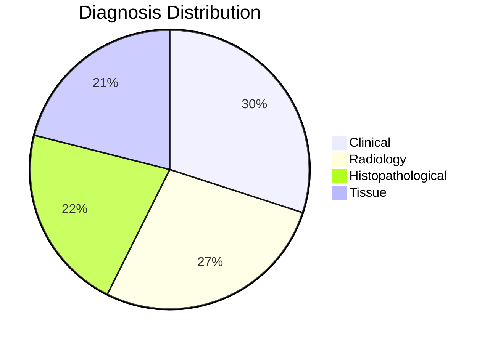

# Patient Volume Forecasting System

## 📌 Overview
An Excel-based solution for healthcare administrators to track patient visits, analyze revenue streams, and forecast required patient volumes to meet financial targets.

## 🗂️ File Structure
| Sheet Name          | Description                                                                 |
|---------------------|-----------------------------------------------------------------------------|
| `day-to-day report` | Daily patient tracking with diagnoses and payments                          |
| `searcher`         | Patient lookup functionality                                               |
| `fixed cost`       | Monthly fixed expenses (rent, salaries, etc.)                              |
| `variable cost`    | Variable monthly costs (labor, medications)                                |
| `calculation`      | Key performance metrics and financial analysis                             |
| `Goal seek`        | Revenue target projection tool                                             |

## ✨ Key Features

### 📊 Patient Management
- 191 sample patient records
- Tracks:
  - Patient ID (NADXXXXX format)
  - Contact information
  - Diagnosis type (4 categories)
  - Payment amounts

### 💰 Financial Analysis
| Metric                      | Value       |
|-----------------------------|-------------|
| Total Monthly Revenue       | ₹123,535    |
| Average Revenue per Patient | ₹646.78     |
| Fixed Costs                 | ₹70,000/mo  |
| Variable Costs              | ₹23,000/mo  |

### 🎯 Goal Seeking Module

Set financial targets in the `Goal seek` sheet to automatically calculate:

| Calculation                         | Formula                      |
|-------------------------------------|------------------------------|
| Average monthly revenue             | `=F6`                        |
| Desired revenue target              | `1,000,000`                  |
| Months required to reach target     | `=IF(F6=0, "", 1000000 / F6)` |
| Years required                      | `=IF(E4="", "", E4 / 12)`    |
| Patients needed to treat            | `=E6 * 31`                   |

### 🔍 Diagnostic Breakdown

